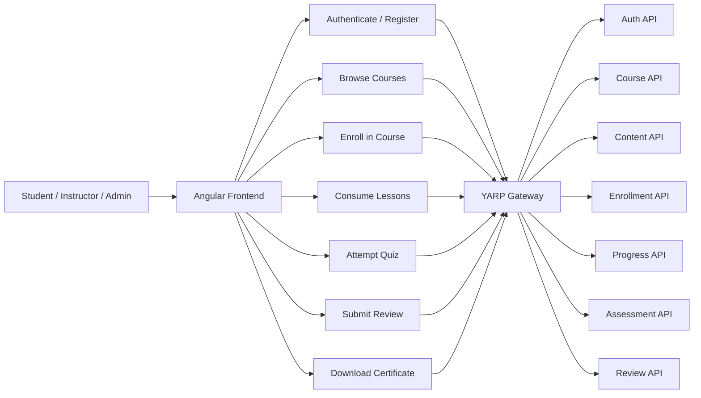
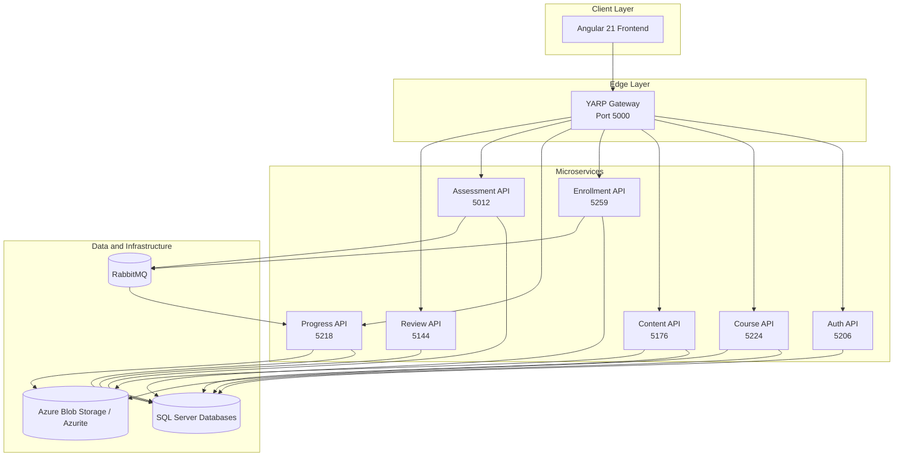
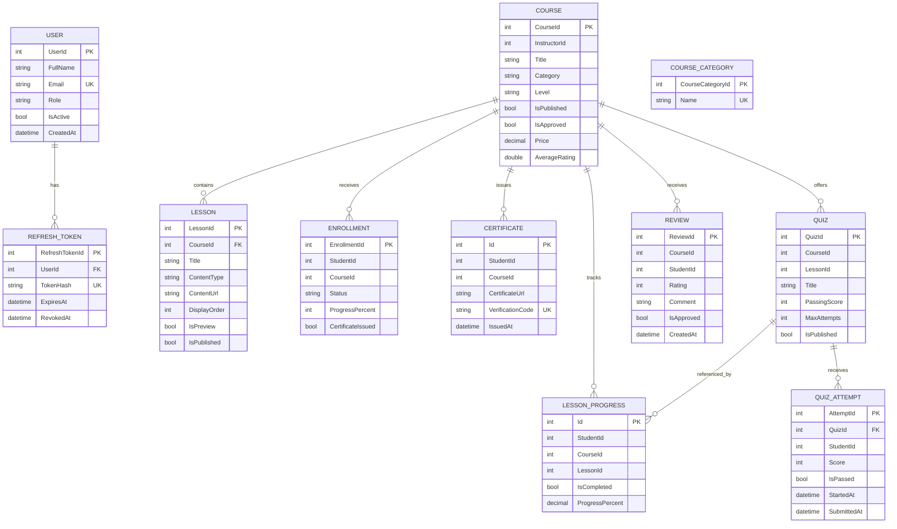

# EduLearn Backend

EduLearn Backend is the .NET 10 microservices layer for the EduLearn platform. It contains the domain APIs, shared contracts, reverse proxy, and service-level tests used by the application.

## Current Status

The backend is organized as a microservices solution and currently includes:

- authentication and identity services
- course catalog and moderation services
- lesson content services
- enrollment and completion workflows
- progress tracking and certificate generation
- quiz authoring and scoring
- course review and moderation services
- a YARP gateway for single-origin frontend access
- service-specific automated tests

## Repository Layout

```
edulearn-backend/
├── src/
│   ├── EduLearn.Auth.API/
│   ├── EduLearn.Course.API/
│   ├── EduLearn.Content.API/
│   ├── EduLearn.Enrollment.API/
│   ├── EduLearn.Progress.API/
│   ├── EduLearn.Assessment.API/
│   ├── EduLearn.Review.API/
│   ├── Edulearn.Gateway.API/
│   └── EduLearn.Shared/
└── tests/
    ├── EduLearn.Auth.Tests/
    ├── EduLearn.Course.Tests/
    ├── EduLearn.Content.Tests/
    ├── EduLearn.Enrollment.Tests/
    ├── EduLearn.Progress.Tests/
    ├── EduLearn.Assessment.Tests/
    └── EduLearn.Review.Tests/
```

## Backend Services

| Service | Port | Responsibility |
|---|---:|---|
| EduLearn.Auth.API | 5206 | Registration, login, JWT, refresh tokens, profile |
| EduLearn.Course.API | 5224 | Course CRUD, publish flow, moderation, search, thumbnails |
| EduLearn.Content.API | 5176 | Lessons, ordering, preview access, video upload |
| EduLearn.Enrollment.API | 5259 | Enroll / unenroll flow and completion events |
| EduLearn.Progress.API | 5218 | Lesson progress, completion handling, certificate generation |
| EduLearn.Assessment.API | 5012 | Quizzes, attempts, scoring, pass/fail evaluation |
| EduLearn.Review.API | 5144 | Course reviews and moderation |
| Edulearn.Gateway.API | 5000 | Reverse proxy for frontend API traffic |

## Gateway Routing

The gateway provides the single public API origin used by the frontend during local development.

| Gateway Path | Proxied To |
|---|---|
| `/gateway/auth/**` | Auth API |
| `/gateway/course/**` | Course API |
| `/gateway/course/reviews/**` | Review API shortcut |
| `/gateway/content/**` | Content API |
| `/gateway/enrollment/**` | Enrollment API |
| `/gateway/progress/**` | Progress API |
| `/gateway/assessment/**` | Assessment API |
| `/gateway/review/**` | Review API |

## Diagrams

### Design Diagram

This diagram shows the main user flow through the platform.



### Architecture Diagram

This diagram shows the logical system architecture, including the gateway, service boundaries, and external infrastructure.



### Database Diagram

The project uses separate databases per microservice. The diagram below shows the core tables and the main logical relationships used by the backend.



Course categories are maintained as a seeded lookup in the Course API. Review records are owned by the Review API, while the Course API keeps the course-level review projection used for aggregation and display.

## Shared Contract

`EduLearn.Shared` contains the cross-service event contracts used by the microservices. The main shared contract currently is `ICourseCompletedEvent`, published by enrollment and assessment flows and consumed by progress handling.

## Prerequisites

- .NET SDK 10
- SQL Server
- RabbitMQ or a compatible hosted endpoint
- Azure Storage account or Azurite for local blob storage
- Node.js 20+ and npm 10+ for the frontend workspace

## Local Setup

### 1. Restore dependencies

```powershell
dotnet restore .\EduLearn.Auth.slnx
```

### 2. Apply database migrations

Run the migrations for each API that owns a database:

```powershell
dotnet ef database update --project .\edulearn-backend\src\EduLearn.Auth.API\EduLearn.Auth.API.csproj
dotnet ef database update --project .\edulearn-backend\src\EduLearn.Course.API\EduLearn.Course.API.csproj
dotnet ef database update --project .\edulearn-backend\src\EduLearn.Content.API\EduLearn.Content.API.csproj
dotnet ef database update --project .\edulearn-backend\src\EduLearn.Enrollment.API\EduLearn.Enrollment.API.csproj
dotnet ef database update --project .\edulearn-backend\src\EduLearn.Progress.API\EduLearn.Progress.API.csproj
dotnet ef database update --project .\edulearn-backend\src\EduLearn.Assessment.API\EduLearn.Assessment.API.csproj
dotnet ef database update --project .\edulearn-backend\src\EduLearn.Review.API\EduLearn.Review.API.csproj
```

### 3. Run the backend services

Start each service in a separate terminal:

```powershell
dotnet run --project .\edulearn-backend\src\EduLearn.Auth.API\EduLearn.Auth.API.csproj
dotnet run --project .\edulearn-backend\src\EduLearn.Course.API\EduLearn.Course.API.csproj
dotnet run --project .\edulearn-backend\src\EduLearn.Content.API\EduLearn.Content.API.csproj
dotnet run --project .\edulearn-backend\src\EduLearn.Enrollment.API\EduLearn.Enrollment.API.csproj
dotnet run --project .\edulearn-backend\src\EduLearn.Progress.API\EduLearn.Progress.API.csproj
dotnet run --project .\edulearn-backend\src\EduLearn.Assessment.API\EduLearn.Assessment.API.csproj
dotnet run --project .\edulearn-backend\src\EduLearn.Review.API\EduLearn.Review.API.csproj
dotnet run --project .\edulearn-backend\src\Edulearn.Gateway.API\Edulearn.Gateway.API.csproj
```

### 4. Run the frontend

```powershell
cd .\edulearn-frontend
npm install
npm start
```

Open `http://localhost:4200` in the browser.

## Configuration Notes

- Each API uses its own `appsettings.json` and `appsettings.Development.json`.
- JWT settings must be consistent across the services that validate tokens.
- The frontend should call the gateway at `http://localhost:5000/gateway/` during local development.
- Azure Storage is used for blob-backed assets such as content files, thumbnails, and certificates.

## Swagger URLs

| Service | Swagger URL |
|---|---|
| Auth | http://localhost:5206/swagger |
| Course | http://localhost:5224/swagger |
| Content | http://localhost:5176/swagger |
| Enrollment | http://localhost:5259/swagger |
| Progress | http://localhost:5218/swagger |
| Assessment | http://localhost:5012/swagger |
| Review | http://localhost:5144/swagger |

## Automated Tests

Service-level tests are available in `edulearn-backend/tests/`. Run the full backend test suite with:

```powershell
dotnet test .\EduLearn.Auth.slnx
```

You can also target individual services, for example:

```powershell
dotnet test .\edulearn-backend\tests\EduLearn.Review.Tests\EduLearn.Review.Tests.csproj
```

